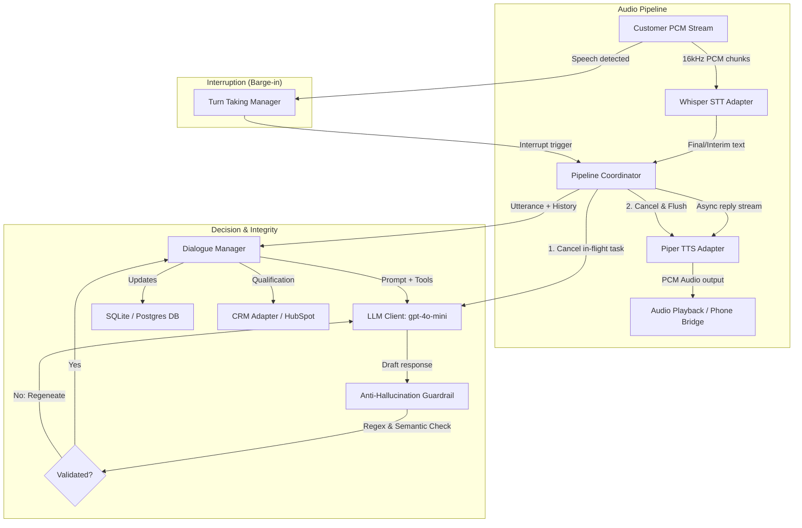

# Echosphere Voice Agent Pipeline

Echosphere is a high-performance voice agent pipeline designed for natural, real-time telephony conversations. It integrates automated Speech-to-Text (STT), a structured Dialogue Manager powered by Large Language Models, and Text-to-Speech (TTS) with sub-250ms barge-in interruption latency and strict data-integrity checks.

---

## 1. System Architecture

The following diagram illustrates how raw customer audio chunks, state managers, LLM decision engines, and real-time synthesis are coordinated:



---

## 2. Core Features

1. **Sub-250ms Barge-In Interruption:** When the customer speaks, the `TurnTakingManager` detects the energy/VAD threshold, cancels the active dialogue generation task, and flushes the Piper synthesis queue within ~200ms to stop the agent mid-sentence.
2. **Anti-Hallucination Guardrails:** If the LLM mentions a price, feature, or promotion that was not explicitly returned by a database tool query on the current turn, the guardrail rejects the draft response and forces a regeneration.
3. **Google Calendar Adapter:** Features live Google Calendar integration with timezone lookup and availability overlap checking. Fully implements fallback to local SQLite tables (`available_slots` and `bookings`) if credentials are missing or API calls fail at runtime.
4. **Escalation Policy Engine:** Dynamically checks customer turns against escalation rules (large team size $\ge 100$, human keywords, $\ge 3$ unresolved objections, sentiment anger, or $\ge 3$ guardrail blocks) and routes calls to `"warm_transfer"` or `"async_handoff"` (creating follow-up task context in the CRM) based on business hours.
5. **Outcome Resolution & Logging:** End-of-call paths mapped to distinct outcome states (`meeting_booked`, `follow_up_scheduled`, `disqualified`, `escalated`). A final `CallLogEntry` is guaranteed to be saved on all exit paths.
6. **Graceful Outage Escalation:** If the LLM connection fails or hits rate limits, the pipeline coordinator catches the error, sets the call state to `"escalated"` in the database to prevent silent state mismatches, and triggers a fallback TTS message: *"I'm sorry, I'm having a technical issue looking up that information. Let me transfer you to a human agent."*
7. **Dynamic LLM Provider & Local Fallback:** Routes queries to **GitHub Models (`gpt-4o-mini`)** or **Groq (`llama-3.3-70b`)**. If rate-limited (429), it automatically routes queries to a local **Ollama (`qwen2.5:1.5b`)** model.

---

## 3. Assets to Save Separately (For Running Locally on a GPU)

Because large weights, databases, and credentials are excluded from Git for privacy and performance reasons, you must download and save the following assets separately to run the project on a local GPU machine:

### A. The `.env` Configuration File
Contains API tokens and configuration settings. Save this in the root folder as `.env`:
```ini
# Primary LLM Configuration
GITHUB_TOKEN=your_github_models_token
GITHUB_MODEL=gpt-4o-mini
USE_GROQ=false
GROQ_API_KEY=your_groq_api_token
GROQ_MODEL=llama-3.3-70b-versatile

# Fallback Configuration
OLLAMA_MODEL=qwen2.5:1.5b

# Telephony Config (For Handoff Handoff)
TELEPHONY_PROVIDER=mock

# Google Calendar Integration
GOOGLE_CALENDAR_CREDENTIALS_PATH=meta-history-327812-05abc2722f5c.json
GOOGLE_CALENDAR_ID=your_calendar_id@group.calendar.google.com
```

### B. Piper Voice ONNX Assets (TTS)
Download and place the Piper voice files inside a `.piper/` directory at the project root:
* **Model Weight:** `en_US-amy-low.onnx` (Voice weight)
* **Model Config:** `en_US-amy-low.onnx.json` (Voice configuration)

*Note: AMD or NVIDIA GPUs can execute Piper ONNX synthesis in under 50ms using ONNX Runtime with CUDA execution providers.*

### C. Whisper CTranslate2 Weights (STT)
The `faster-whisper` package automatically downloads models from Hugging Face on first load and caches them in your local system (`~/.cache/huggingface/hub/`). 
* To run on a GPU, ensure you have **CUDA** and **cuDNN** installed on your system.
* You can change the model load parameters in `pipeline/whisper_adapter.py` to specify GPU compute:
  ```python
  self.model = WhisperModel("base.en", device="cuda", compute_type="float16")
  ```

### D. Local Ollama LLM Fallback (Dialogue)
If the primary cloud LLMs are rate-limited, the system falls back to a local Ollama instance:
* Install [Ollama](https://ollama.com).
* Run the following command on your machine to pre-load the lightweight Qwen model:
  ```bash
  ollama pull qwen2.5:1.5b
  ```
  *(If your GPU has >8GB VRAM, you can pull a larger and more coherent model like `qwen2.5:7b-instruct` or `llama3.2:3b` and update `OLLAMA_MODEL` in `.env` accordingly).*

---

## 4. Quickstart Guide

### 1. Installation
Set up your virtual environment and install dependencies:
```bash
# Create venv
python -m venv .venv
.venv\Scripts\activate

# Install requirements
pip install -r requirements.txt
```

### 2. Run the Verification Tests
To run all test harnesses and verify pipeline mechanics:
```bash
# Run all tests in the repository
.venv\Scripts\pytest -v

# Run the voice pipeline simulator
.venv\Scripts\python tests/voice_pipeline_simulator.py

# Run the chat simulator
.venv\Scripts\python tests/chat_simulator.py
```
